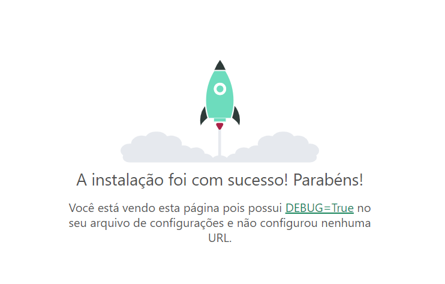

# Criando um projeto
Com o ambiente virtual ativado, instale o [Django](https://www.djangoproject.com). 
``` bash
pip install Django==5.0.1
```
Dentro da pasta que você criou, crie um projeto. Digite no terminal:

``` bash
django-admin startproject core .
```
Isso irá criar um arquivo chamado **manage.py** e uma pasta chamada **core**, esta será nossa pasta de configuração.

## Configurando o *settings.py*
Dentro da pasta *core*, procure pelo arquivo **settings.py**, adicione `import os` no ínicio deste arquivo.

Próximo ao fim do arquivo, edite as seguintes linhas para definir o **idioma para português** e o **fuso horário para SP**.
``` python
LANGUAGE_CODE = 'pt-br';

TIME_ZONE = 'America/Sao_Paulo';
```

## Rodando nosso projeto
Em seguida, digite no terminal os seguintes comandos:
``` bash
python manage.py migrate
python manage.py runserver
```

O primeiro serve para criar um banco de dados básico, que cobriremos mais tarde. O segundo serve para rodar na máquina um servidor e pôr o nosso site localmente no ar. Caso queira testar, basta clicar no link que aparece no terminal ou acessar o [localhost](http://127.0.0.1:8000).

Se tudo tiver dado certo, você deve ver a seguinte página:



Para encerrar a execução do servidor, aperte **CTRL+C no terminal**.

## Criando um Super Usuário
Para continuar, vamos criar um "super usuário" (ou Administrador). No terminal, digite:
``` bash
python manage.py createsuperuser
```
Pelo próprio terminal, preencha login, e-mail e senha. Você pode testar o login em:
- http://127.0.0.1:8000/admin

Por esse painel admin é possível interagir diretamente com o banco de dados. A princípio, temos apenas *Grupos* e *Usuários*, criado pelo próprio Django quando o comando *migrate* foi utilizado. Veremos isso mais a frente, quando criarmos mais classes para o BD.

## Criando um app
O próximo passo é criar o nosso primeiro app. Os app vão nos auxiliar a separar as funcionalidades da aplicação e manter tudo mais organizado. Começaremos criando um app para as páginas HTML que criaremos para o site. 

No terminal, digite:
``` bash
python manage.py startapp <nome_do_app>
```	

**IMPORTANTE**: Para este projeto de exemplo, chamarei este primeiro app de **products**
```bash
python manage.py startapp products
```
O Django irá criar uma nova pasta no projeto com alguns arquivos.

Agoras precisamos configurar nosso app no projeto. Vamos acessar nosso arquivo **settings.py** e nele vamos procurar por **INSTALLED_APPS**, adicionando na última linha:
```python
INSTALLED_APPS = [
    ...

    'products', #nome do seu app
]
```

## Criando um template
Vamos criar a primeira página da aplicação que será a página inicial do projeto. Vamos criar dentro da pasta do app uma pasta chamada **templates**, que terá todos os HTML que criarmos para as diferentes páginas do projeto.
```
<nome_do_app>/
├── templates/
└── ...
```
E, dentro da pasta, um arquivo chamado **index.html**, que será a nossa página inicial.

Apenas como teste, vamos pôr no index.html algo bem simples:
``` html
<!DOCTYPE html>
<html lang="pt-br">
<head>
    <meta charset="UTF-8">
    <meta name="viewport" content="width=device-width, initial-scale=1.0">

    <title>Página Inicial</title>

</head>
<body>
    <h1>Bem vindos ao meu Projeto Django!</h1>
</body>
</html>
```

Agora vamos configurar nossa **pasta de templates** no projeto. Para isso, vamos ao **settings.py** e procurar por **TEMPLATES**.
```py
TEMPLATES = [
    {
        ...
        'DIRS': [os.path.join(BASE_DIR, 'templates')],
        ...
    }
]
```
O que estamos fazendo aqui é adicionando aos templates do projeto a pasta templates que criamos anteriormente. Dessa forma, todos os arquivos que colocarmos naquela pasta já serão identificados pelo projeto automaticamente.

## Criando uma view
Com a página criada, vamos em **views.py**, vamos adicionar uma função **index** nesse arquivo. A função **render** importada no topo do arquivo é responsável por renderizar templates.
``` python
from django.shortcuts import render 

def index(request):
    return render(request, 'index.html')
```

Além da página, precisamos configurar seu endereço. Para isso, dentro da pasta do app, vamos criar mais um arquivo chamado **urls.py** e nele vamos adicionar:
``` python
from django.urls import path
from .views import index

urlpatterns = [
    path('inicio/', index, name='index'),
]
```
Basicamente estamos informando que o endereço (path) 'início/' vai ser "representado" pela função **index** (que é a nossa página index.html). 

Agora, vamos no outro arquivo do projeto chamado **urls.py**, na **pasta core**, e vamos editar para:
```python
from django.contrib import admin
from django.urls import path, include #para incluir os urls do nosso app

urlpatterns = [
    path('admin/', admin.site.urls),
    path('cadastros/', include('products.urls')), #definindo a url
]
```

Aqui nós estamos dando um nome para este caminho do link (cadastros/) e incluindo após ele o que estiver no arquivo em **products/urls.py**. Sendo assim, agora o endereço da nossa página inicial seria:
-	http://127.0.0.1:8000/cadastros/inicio/

Caso queira, você pode deixar o path vazio para que não seja necessário adicionar nada no caminho da página e, portanto, encurtando o link. Dessa forma, podemos **deletar cadastros/** e deixar apenas:
```python
    path('', include('products.urls')),
```

Para ter como link inicial:
- http://127.0.0.1:8000/inicio/

Você também pode retirar o **'inicio/'** no urls.py do seu app. Para um link limpo:
- http://127.0.0.1:8000/

## Fazendo migrações
Faça as migrações necessárias para o projeto funcionar, visto que agora criamos um novo app. Sempre que modificarmos as configurações do nosso projeto, é importante fazermos novas migrações.
```bash
python manage.py makemigrations
python manage.py migrate
```

Agora, com tudo configurado, devemos conseguir rodar o servidor e abrir nossa página no [**localhost**](http://127.0.0.1:8000/).

## Siga para o próximo documento -> [Arquivos Estáticos](/docs/arquivos-estaticos.md)
## [Acessar Sumário](../README.md#sumário)